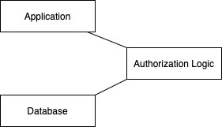

# Architecture and Design

### Change History

| Version | Date        | Modifier         | Description of Change |
| ------- | ----------- | ---------------- | --------------------- |
| 0.1     | 05 Apr 2020 | Riccardo Sartori | Initial draft.        |

## 1. Introduction

This document describes the architecture and design for the PCTOkay! application being developed for ITI G. Marconi. The application's purpose is to easily search and manage PCTO companies and student internships. Students will be able to search companies to go to thanks to a filtered search, and PCTO tutors will be able to update each company's data and register internships. The application will use the same credentials as the Classeviva site to ensure that only ITI G. Marconi students will be able to access it.

The purpose of this document is to describe the architecture and design of the PCTOkay! application in a way that addresses the interests and concerns of all major stakeholders. For this application the major stakeholders are:

+ **Users and the customer:** They want assurance that the architecture will provide functionality, but mainly flexibility.
+ **Project Manager:** The project manager coordinates all developement, as it is also the only developer involved. They want a system that can be divided in multiple small parts, each of minimal complexity to also speed up development.

The architecture and design for a software system is complex and individual stakeholders often have specialized interests. There is no one diagram or model that can easily express a system’s architecture and design. For this reason, software architecture and design is often presented in terms of multiple views or perspectives [IEEE Std. 1471]. Here the architecture of the PCTOkay! application is described from 4 different perspectives:

1. Logical View – major components, their attributes and operations. This view also includes relationships between components and their interactions. When doing OO design, class diagrams and sequence diagrams are often used to express the logical view.
2. Process View – the threads of control and processes used to execute the operations identified in the logical view.
3. Development View – how system modules map to development organization. 
4. Scenarios – the use case view is used to both motivate and validate design activity. At the start of design the requirements define the functional objectives for the design. Use cases are also used to validate suggested designs. It should be possible to walk through a use case scenario and follow the interaction between high-level components. The components should have all the necessary behavior to conceptually execute a use case.

## 2. Design Goals

The design priorities for the PCTOkay! application are:

+ **Flexibility:** The design should be as flexible as possible, as the company's data about PCTO is constantly changing. This is the most important requirement.
+ **Simplicity:** The design should be as simple as possible, so that future developers may pick it up with ease. This, of course, shall not interfere with flexibility.

## 3. System Behavior

The system shall be divided in many sections:

+ **Company search:** This section will allow users to search for companies using one or more filters, and save them if they want to remember it later.
+ **Company details:** This section will contain all of a company's details, including internships. Privileged users will be able to modify these informations.
+ **Activities:** This section will manage the activities that companies can make interns do during their summer internship. Only privileged users will be able to see and modify this section.

## 4. Logical View

### 4.1. High-Level Design

The High-Level Design consists of 3 major components:

+ **Application:** The frontend of the application. Displays companies to the user, and takes all input
+ **Authorization Logic:** This logic checks if an user can perform a certain task on the database or not
+ **Database:** The application's storage, containing all of the company's information

### 4.2. Mid-Level Design

### 4.3. Detailed Class Diagram

## 5. Process View

## 6. Physical View

This application uses no physical components, it can all be deployed on a platform for hosting websites such as Aruba or Altervista.

## 7. Scenarios

The application has the following cases:

+ **Search:**
  + Student logs in
  + Student applies filters to the companies
  + Student may save companies
  + Student logs out, or session runs out
+ **Modify company:**
  + Tutor logs in
  + Tutor goes on a company's details page
  + Tutor changes, adds or deletes a field or an internship
  + Tutor may log out or proceed modifying