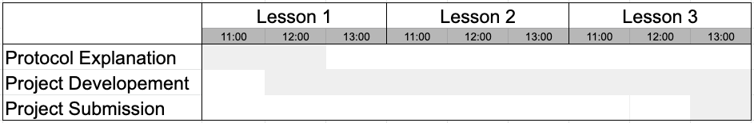

# Software Project Management Plan
# Chat Protocol
03/01/2020

#### Team Members
+ Sartori Riccardo
+ Ghisellini Damiano
+ Mafficini Andrea
+ Bianchini Davide

#### Document Control
| Revision | Change Date | Description of Changes |
| -------- | ----------- | ---------------------- |
| V1.0 | 03/01/2020 | Initial Release |

#### Document Storage
This document, along with the rest of the documentation for the project, is stored at https://2020-5bi-team4-sartori.readthedocs.io/en/latest/

# 1 Overview

## 1.1 Purpose and Scope
This project is about creating a chat capable of sending and receiving messages, and that will require a server and a client. The two actors will communicate using a custom protocol defining the type of messages they send to each other. This application will be developed so students can understand a possible application of network-level development and how to do it.

The application will most likely never be used outside the classroom it was developed in, as it is merely an exercise to understand how this part of programming works. No type of help will be provided to the end user, since it's implied they are familiar with the protocol and with how an average client/server application implementing it looks like.

## 1.2 Goals and Objectives

### 1.2.1 Project Goals
1. Teach students how to program low-level applications.
2. Help students understand how packets are sent or received and which protocols work best in which situations.

### 1.2.2 Project Objectives
1. Create a server capable of handling multiple requests at the same time using threads.
2. Create a client software that can make use all of the protocol's functionalities.

## 1.3 Project Deliverables

| Date | Deliverable |
| ---- | ----------- |
| 29/10/2019 | Source code for either the client or the server portion |

## 1.4 Assumptions and Constraints

### 1.4.1 Assumptions
1. All machines have Python 3.7 or higher installed

### 1.4.2 Constraints
1. The application will use the protocol given to us
2. The application will be written in Python 3.7 or higher
3. The application will be ready by 29/10/2019

## 1.5 Schedule and Budget Summary

## 1.6 Success Criteria

Either:
1. A server capable of receiving and handling multiple requests from multiple hosts
2. A client capable of connecting and communicating with a server, interpreting the responses it sends.

All parts of the protocol must be correctly implemented.

## 1.7 Definitions

1. **Student:** A person developing the project, not necessarily part of our team.
2. **Protocol:** A custom set of rules for 2 or more applications to let them properly communicate. Created specifically for this project. May also be referred to as **Chat Protocol**.

## 1.8 Evolution of the Project Plan

As the project is relatively simple, there is only one phase to the plan, meaning that there can be no evolution.

# 2 Startup Plan

## 2.1 Team Organization

1. **Project Manager:** Must coordinate the team and take orders from the higher-ups.
	+ Sartori Riccardo
2. **Programmers:** Responsible for developing and testing the application. They must partecipate in team meetings and report to the Project Manager.
	+ Ghisellini Damiano
	+ Mafficini Andrea
	+ Bianchini Davide

## 2.2 Project Communications

The team communicates informally through informal gatherings. Team members are free to ask each other information whenever they need it.

## 2.3 Technical Process

The project is small enough to only have one phase, which begins with the start of the app's development and ends when it's finished.

## 2.4 Tools

1. **Programming Language:** Python 3.7 or higher.
2. **Version Control:** Source code will be stored in a git repo.
3. **Development Tools:** PyCharm.

# 3 Work Plan

## 3.1 Activities and Tasks

| Task name | Owner | Task Description |
| --------- | ----- | ---------------- |
| Learning the protocol | Project Manager | Learning how the protocol works, all the possibilities that could arise and teach it to the programmers |
| Development | Programmers, Project Manager | Develop either the client or the server |

## 3.2 Release Plan

| Release | Date | Description |
| ------- | ---- | ----------- |
| Release 1.0 | 29/10/2019 | A fully functioning client or server application |

## 3.3 Iteration Plan

The project is small enough to have only one iteration as well, starting and finishing with the project itself.

## 3.4 Budget

The project has no budget.

# 4 Control Plan

## 4.1 Monitoring and Control

Broad milestones were set for this plan:

1. **15/10/2019:** Explanation of the protocol to implement.
2. Weekly reports to check progress.
3. **29/10/2019:** Project submission.

## 4.2 Project Measurements

| Phase | Measurement |
| ----- | ----------- |
| Project Submission | Record the effort taken to complete the project |

# 5 Supporting Process Plans

## 5.1 Risk Management Plan

| Risk | Probability | Priority | Response |
| ---- | ----------- | ------ | -------- |
| Lack of skill | Very high | Urgent | Private lessons with someone who knows how the various APIs work; requesting help from the teachers. |
| Network issues | Unlikely | Low | Ask help from the technicians. |

## 5.2 Configuration Management Plan

1. The source code will be stored in a git repo.
2. The name of the folder containing the source code will be *team*_*project-name*_01_01, where *team* is our team number and *project-name* is either "client" or "server".

## 5.3 Verification and Validation Plan

Before every lesson, a small check will happen to see how the development is going.

## 5.4 Product Acceptance Plan

### 5.4.1 Client Acceptance Plan
The following points assume a server application is present and functioning correctly.
1. The client must have a functioning user interface (whether text or graphic) and must be able to communicate with a server using the same protocol.
2. The client must have a way to use all the features described in the protocol.
3. The client must handle all responses received from the server.

### 5.4.2 Server Acceptance Plan
The following points assuming a client application is present and functioning correctly.
1. The server must be able to accept connections from multiple hosts at the same time.
2. The server must be able to receive data from remote connections, correctly interpret them and act as needed, following the protocol.

---

Download this document as [PDF](pdf/software_project_management_plan.pdf)