# User Guide

## 1. Introduction

The PCTOkay! application allows users to quickly search companies for their internship. It will also allow PCTO tutors to easily manage said companies, add new ones and record the carried out internships. The application is currently hosted at [riccardosartori.it/pctokay](https://www.riccardosartori.it/pctokay/). Although the documentation is in English, this project was made in Italian.

## 2. Getting Started

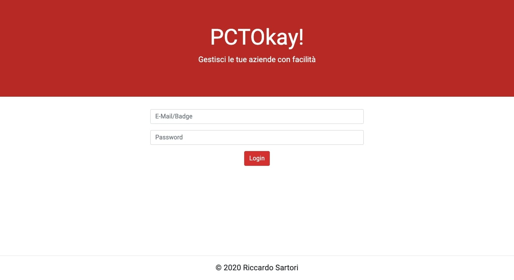

The first thing you'll see will be the login screen. Type the same credentials you use for the Classeviva Spaggiari application. The application only allows ITI G. Marconi students inside.

## 3. Searching companies

### 3.1 Basic search

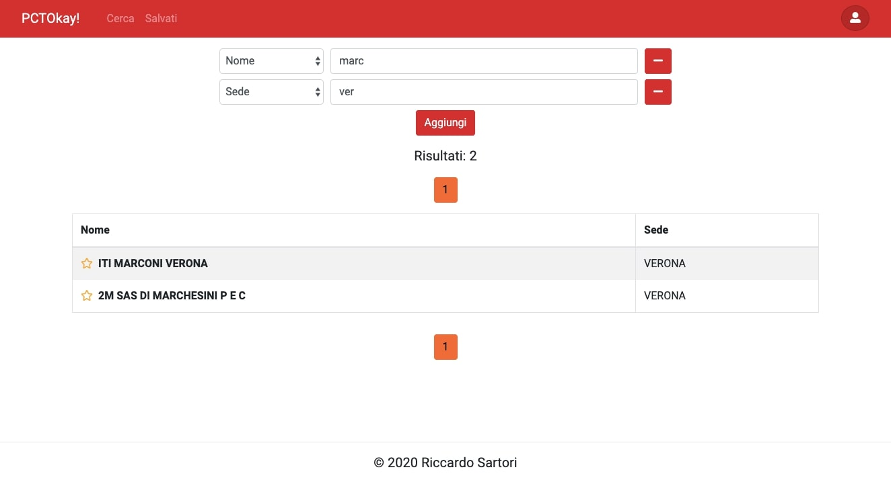

Authenticated users can search companies by a large amount of fields. These fields can vary over time, since the PCTO tutors can change them. To start searching, click the "Cerca" button. You can also search the same field multiple times, as shown below.

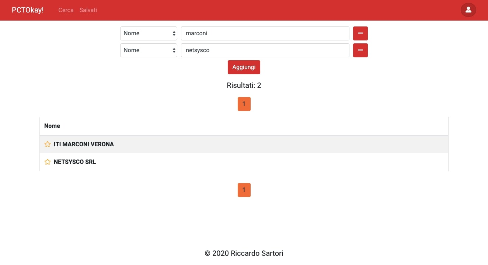

### 3.2 Saving companies

PCTOkay! allows users to save their companies so they don't forget about them. To save a page, simply click the small star next to the company's name. The saved companies can be seen in the corresponding page. You can save up to 50 companies.

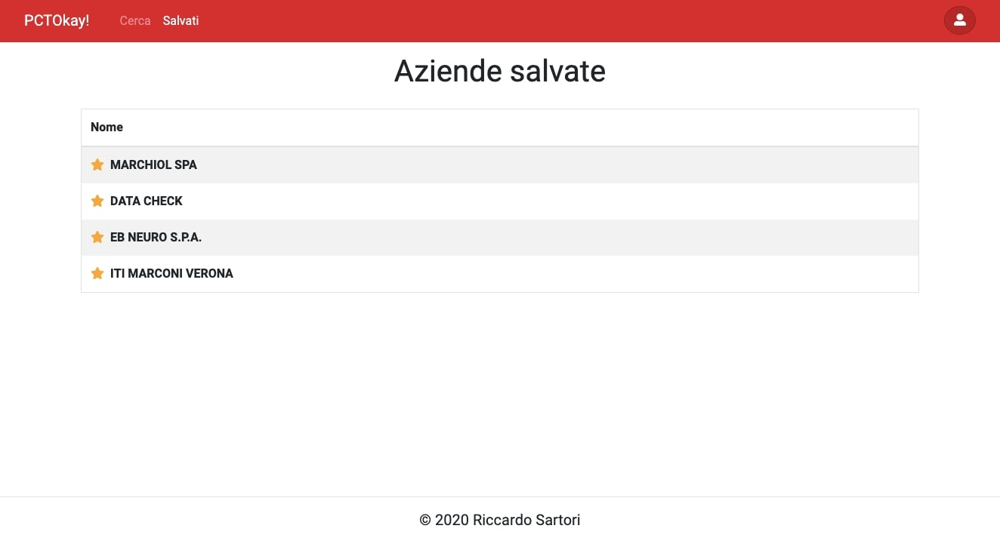

## 4. Companies

### 4.1 Company's page

While the search page only shows basic company information, the company's own page displays everything known about the company.

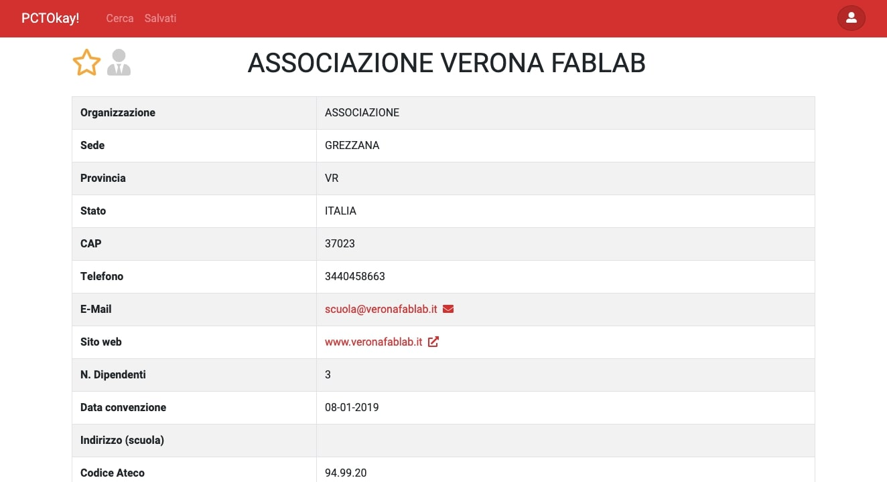

PCTO tutors have also access to buttons that allow them to change a company's data.

+ **Trash icon:** Deletes the company
+ **Pencil icon (name):** Changes the name. The name cannot be empty.
+ **Pencil icon (field):** Changes a field's value. When you insert an invalid value, the textbox glows red (see section 5).

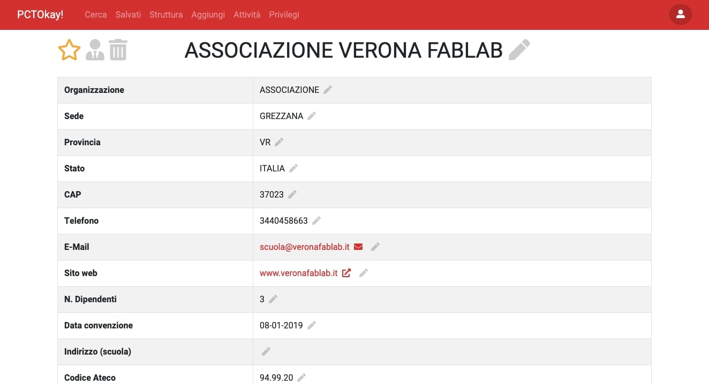

### 4.2 Internships

Clicking on the business man icon next to the company's name, you can see all of the company's internships over the years.

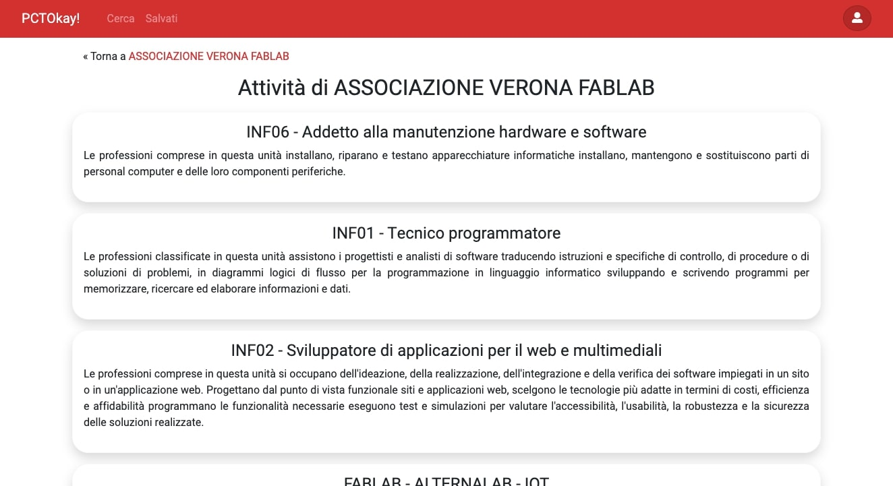

While normal users can only see the type of internships carried out to safeguard the interns' privacy, tutors can also see who was in those internships and in which years. Of course, they can also edit any aspect of those internships and add new ones.

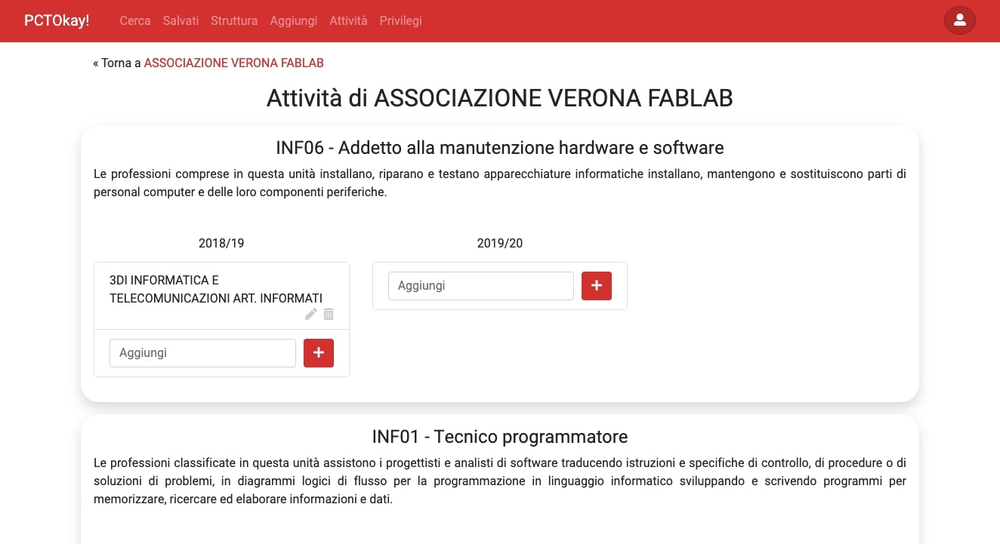

### 4.3 Creating new companies

To create a company, simply type the company's name on the appropriate page and press the "Create" button

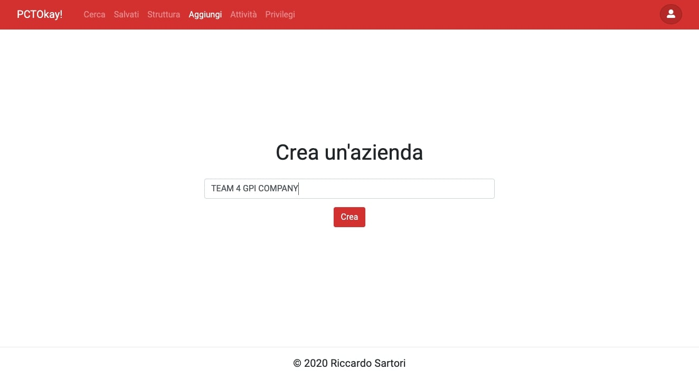

This will create an empty company that you can then fill later.

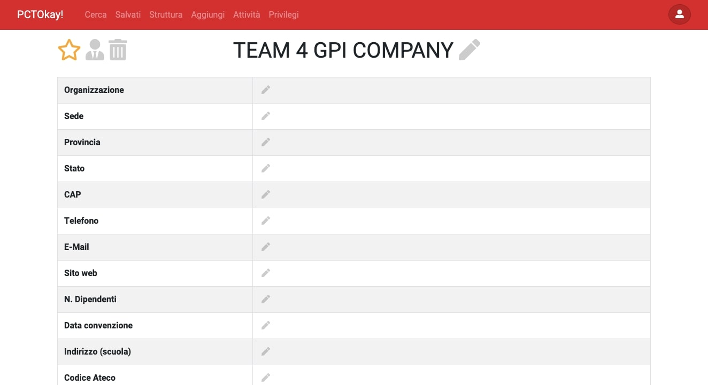

## 5. Data structure

### 5.1 Overview

PCTOkay! is made to be as flexible as possible, and this means that tutors can change how company data is handled with a simple user interface through the "Structure" page.

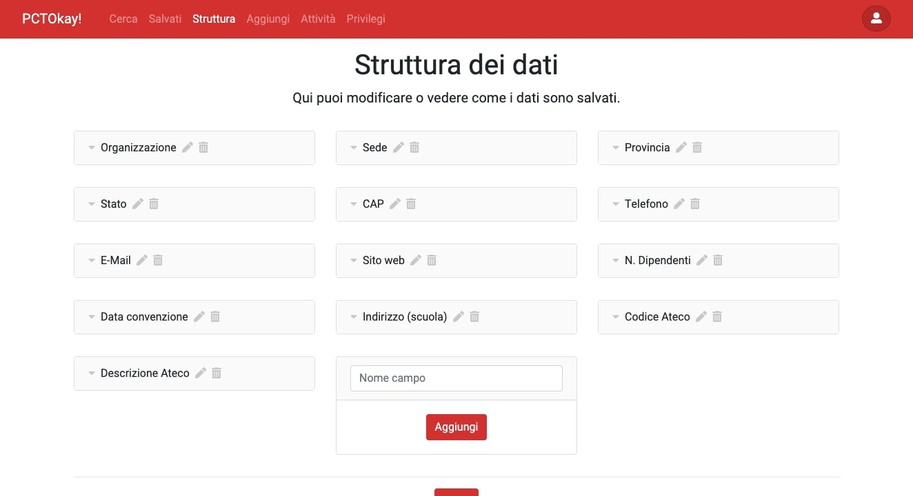

### 5.2 Data types

This page allows tutors to change field names, delete them, create new ones or change existing ones.

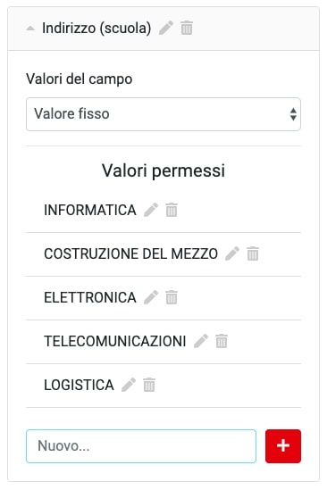

There are many possible presets to choose from, for example emails, dates, any or custom, where you can describe how a datum is formatted yourself. 

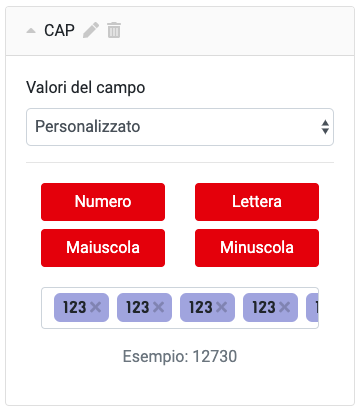

The custom field has four data types:

+ **Numero:** A digit
+ **Lettera:** Any letter, case insensitive.
+ **Maiuscola:** An uppercase letter.
+ **Minuscola:** A lowercase letter.

As you change the field's value, a preview will display under the input field. For example, the CAP is made of five digits, so by pressing the "Numero" button five times we can get the result we want.

After you're done with the changes, you can press the "Save" button.

## 6. Activities

Activities are the types of internships that companies will eventually carry out. They can be managed in their corresponding page.

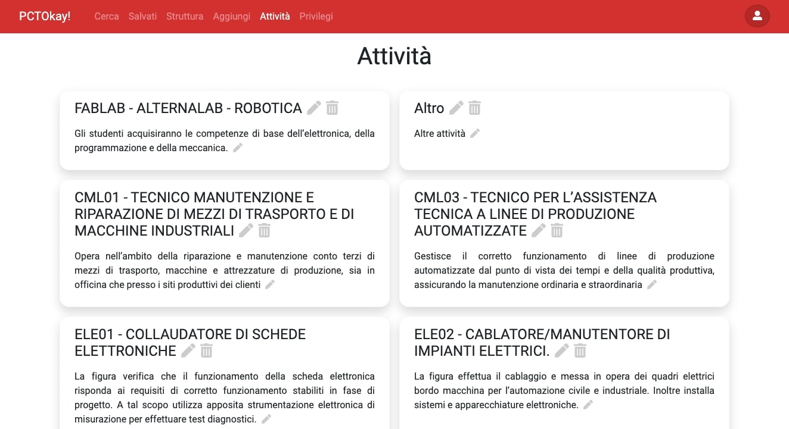

The page allows the deletion, modification or creation of new activities.

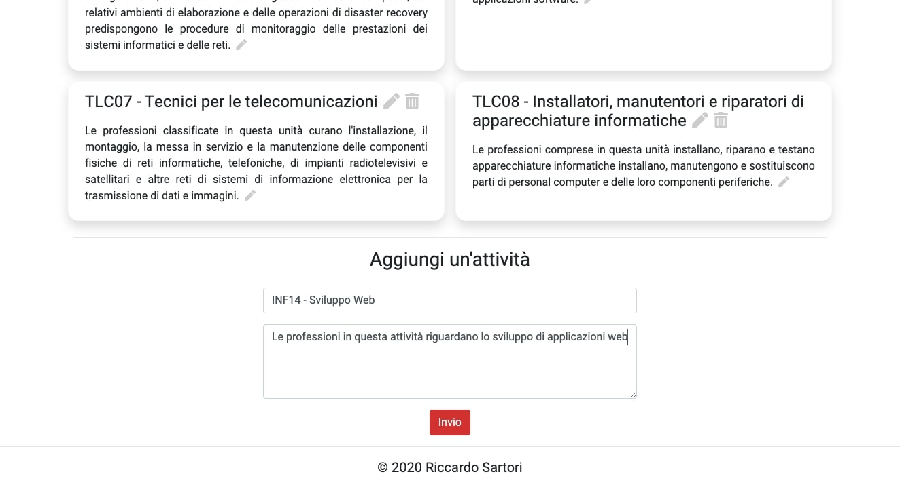

## 7. Privileges

When new teacher wants to become a tutor, they must be granted the privileges they need to the site. The privilege page allows that to happen. This page can only be accessed by a single admin user.

To add privileges to a new user, insert their ID in the input field below, and then press the plus button. The corresponding user's name will appear below to confirm that it's the correct one. To get your own ID, simply click the small user button in the top-right of the screen.

Once the user was added, click the privileges you want to give them. Grante privileges will be have a dark orange background.